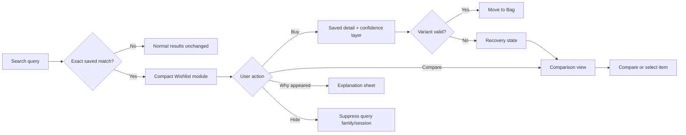
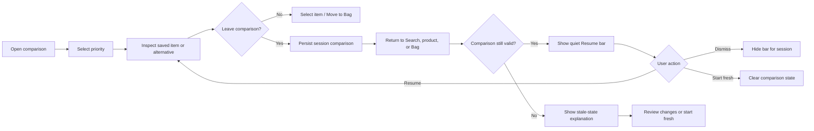
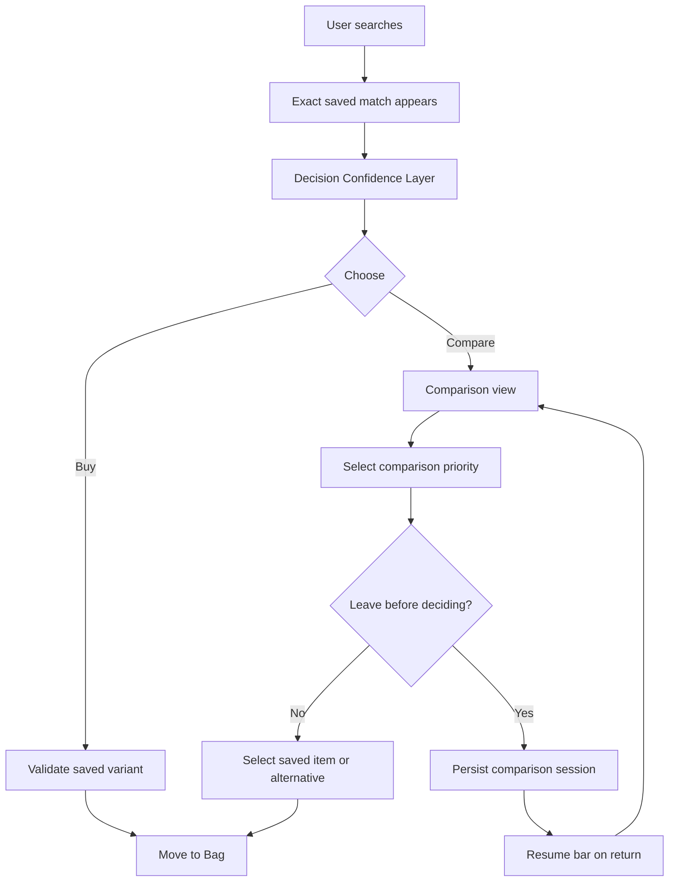

# Myntra Decision Confidence Layer & Comparison Re-entry

## UX Wireframes and Interaction Blueprint

**Parent experience:** Search Interruption MVP  
**Primary objective:** Help users decide whether a previously saved item is still right for them, and allow them to resume comparison without losing context.  
**Constraint:** No monetary incentives, artificial urgency, forced redirects, or silent variant substitutions.

## 1. Feature strategy

The two features solve different moments in the same journey.

| Feature | User problem addressed | Product role |
|---|---|---|
| **Decision Confidence Layer** | “I recognize this saved item, but can I trust it is still the right choice?” | Reduce uncertainty around fit, availability, delivery, returns, and saved variant |
| **Comparison Re-entry** | “I compared options, left to browse or act, and now I cannot easily resume my decision.” | Preserve decision context and allow the user to continue without restarting |

The features should work together but remain independently understandable. The confidence layer should help the user evaluate one saved item. Comparison re-entry should preserve a multi-item decision when the user chooses to explore alternatives.

## 2. Design principles

1. **Recognition before explanation:** Show the saved item and saved variant first; reveal deeper confidence information on demand.
2. **Progressive disclosure:** Keep Search compact and make the confidence layer expandable rather than presenting a dense block of information immediately.
3. **Evidence, not persuasion:** Every confidence signal must be based on current, verifiable product data.
4. **Variant transparency:** Always distinguish the originally saved color/size from the user’s current selection.
5. **Equal agency:** Buy, Compare, Dismiss, and Continue browsing remain legitimate actions.
6. **Context preservation:** Leaving the comparison experience should not destroy the user’s selected items, priority, or search context.
7. **Graceful staleness:** When data changes, explain what changed and offer recovery instead of showing a broken or misleading state.

# Part A — Decision Confidence Layer

## 3. Entry points

The confidence layer can be reached from three locations:

| Entry point | Trigger | Default presentation |
|---|---|---|
| Search interruption module | User sees an exact saved-product match | Compact confidence summary on the saved card |
| Buy from Wishlist | User chooses to act on saved intent | Full saved-product detail with confidence section expanded |
| Compare options | User selects the saved item inside comparison | Confidence summary attached to the “Your saved item” column |

Do not open the full confidence layer automatically from Search. The user should first understand the reconnection, then choose whether to inspect more detail.

## 4. Wireframe DC-01 — Search module with confidence summary

**Purpose:** Reconnect the user to the saved item while keeping Search primary.

```text
┌──────────────────────────────────────────────────────────────┐
│  Search: “black blazer”                         FILTER  SORT  │
├──────────────────────────────────────────────────────────────┤
│  ♥ FROM YOUR WISHLIST                         1 item matches │
│  Shown because your search matches a product in your Wishlist│
│                                                              │
│  ┌───────────┐  MARK TAYLOR                                  │
│  │           │  Striped Blazer                               │
│  │  product  │  Saved: Black · Size M                         │
│  │   image   │  Size M available · Delivery by tomorrow       │
│  └───────────┘  Fit confidence: Check size guide              │
│                                                              │
│  [Buy from Wishlist]                 [Compare options]        │
│  [Why this appeared?]                         [× Hide]       │
└──────────────────────────────────────────────────────────────┘
```

### Interaction behavior

| User action | Result |
|---|---|
| Tap saved product | Open saved product detail with confidence layer available |
| Tap Buy from Wishlist | Open saved variant state with confidence section expanded |
| Tap Compare options | Open comparison view with saved item pinned first |
| Tap Why this appeared? | Open a small explanation sheet, not a full navigation change |
| Tap Hide | Suppress the module for the current query family/session |
| Continue scrolling | Preserve the module above normal results; do not pin it persistently |

### Required content hierarchy

The first view should answer only four questions: What did I save? Which variant did I save? Can I buy it now? What are my next choices? Deeper information belongs behind the confidence interaction.

## 5. Wireframe DC-02 — Why this appeared sheet

**Purpose:** Make the personalization logic transparent and provide control.

```text
┌──────────────────────────────────────────────────────────────┐
│  Why are you seeing this?                                  × │
├──────────────────────────────────────────────────────────────┤
│  Your search matches a product in your Wishlist.             │
│                                                              │
│  We show it here so you can revisit your saved choice        │
│  without searching for it again.                             │
│                                                              │
│  [View saved item]                                            │
│  [Hide Wishlist matches in Search]                           │
│  [Close]                                                     │
└──────────────────────────────────────────────────────────────┘
```

The explanation must not reveal sensitive occasion tags or private intent unless the user explicitly chose to display them. The sheet should be dismissible and should not interrupt the normal Search results.

## 6. Wireframe DC-03 — Saved product detail with confidence layer

**Purpose:** Help the user decide whether the saved product remains suitable.

```text
┌──────────────────────────────────────────────────────────────┐
│  ← Back to results                                  ♡ Saved  │
├──────────────────────────────────────────────────────────────┤
│  ┌──────────────────┐  MARK TAYLOR                           │
│  │                  │  Striped Blazer                        │
│  │   product image  │  Saved: Black · Size M                  │
│  │                  │  ₹ current price                       │
│  └──────────────────┘  Seller: verified listing               │
│                                                              │
│  DECISION CONFIDENCE                                         │
│  ┌──────────────────────────────────────────────────────────┐ │
│  │ ✓ Saved variant                                           │ │
│  │   Black · Size M                                          │ │
│  │ ✓ Availability                                            │ │
│  │   Size M available                                        │ │
│  │ ✓ Delivery                                                │ │
│  │   Delivery by tomorrow to 400001                         │ │
│  │ ? Fit                                                    │ │
│  │   Check size guide · See why                              │ │
│  │ ✓ Returns                                                 │ │
│  │   30-day returns                                          │ │
│  └──────────────────────────────────────────────────────────┘ │
│                                                              │
│  COLOR  [Black — saved] [Navy] [Beige]                      │
│  SIZE   [S] [M — saved] [L] [XL]                             │
│                                                              │
│  [Move to Bag]                         [Compare options]       │
└──────────────────────────────────────────────────────────────┘
```

### Confidence signal rules

| Signal | Display rule |
|---|---|
| Saved variant | Always show the original saved color and size |
| Size availability | Use current inventory; never infer from another size |
| Fit | Explain the basis, such as size guide or prior fit data; do not claim certainty without evidence |
| Delivery | Recalculate against the current delivery pincode |
| Returns | Show the current return policy for the selected seller/listing |
| Reviews | Show current review coverage; distinguish count from quality judgment |
| Price | Show the current price only; do not show historical-price urgency |
| Seller | Show current seller/listing information if it can change purchase confidence |

## 7. Wireframe DC-04 — Confidence detail sheet

**Purpose:** Provide deeper evidence without overloading the first product screen.

```text
┌──────────────────────────────────────────────────────────────┐
│  Decision confidence                                      ×  │
├──────────────────────────────────────────────────────────────┤
│  FOR YOUR SAVED ITEM                                        │
│                                                              │
│  Saved: Black · Size M                                      │
│                                                              │
│  FIT                                                        │
│  Your saved size is available.                              │
│  [Open size guide] [Change size]                             │
│                                                              │
│  MATERIAL                                                   │
│  Cotton blend · lightweight feel                            │
│                                                              │
│  DELIVERY                                                   │
│  Delivery by tomorrow to 400001                             │
│  [Change pincode]                                            │
│                                                              │
│  RETURNS                                                    │
│  30-day returns for this listing                             │
│                                                              │
│  REVIEWS                                                    │
│  4.2 ★ from 4,665 reviews                                   │
│                                                              │
│  [Keep comparing]                       [Move to Bag]         │
└──────────────────────────────────────────────────────────────┘
```

The “why” affordance should explain the source of a confidence signal. For example, “Size guidance is based on this brand’s size guide” is preferable to an unexplained “High fit confidence.”

## 8. Wireframe DC-05 — Variant exception: saved size unavailable

**Purpose:** Handle the most important fashion-specific failure state without silent substitution.

```text
┌──────────────────────────────────────────────────────────────┐
│  FROM YOUR WISHLIST                                         │
│  You saved this, but Size M is unavailable                   │
│                                                              │
│  ┌───────────┐  PROLINE                                     │
│  │  product  │  Polo T-shirt                                │
│  │   image   │  Saved: Olive · Size M                        │
│  └───────────┘  Saved size unavailable                      │
│                                                              │
│  [See available sizes]                 [Compare options]      │
│                                                              │
│  The saved size remains Size M. No size has been changed.    │
└──────────────────────────────────────────────────────────────┘
```

If another size is selected, show **“New selection: Size L”** and retain **“Originally saved: Size M”** until the user completes or cancels the action.

## 9. Wireframe DC-06 — Variant exception: saved color unavailable

```text
┌──────────────────────────────────────────────────────────────┐
│  FROM YOUR WISHLIST                                         │
│  You saved this in Black — other colors are available        │
│                                                              │
│  Saved: Black · UK9                                          │
│  Current available colors: [Red] [Tan] [White]              │
│                                                              │
│  [Buy saved item]                       [Compare options]     │
└──────────────────────────────────────────────────────────────┘
```

The saved color must remain visible even when the product card displays another available color. The user should never mistake the fallback color for the original saved preference.

## 10. Decision Confidence interaction flow



# Part B — Comparison Re-entry

## 11. Re-entry model

Comparison re-entry should be **session-first** in the MVP. It should preserve the comparison when the user navigates back to Search, opens a product, visits Bag, or temporarily leaves the comparison view.

Do not create a permanent comparison history in the first release. That adds privacy and clutter questions before the core behavior is validated.

Persist the following state for the current session:

| State | Example |
|---|---|
| Saved item | United Colors of Benetton Check Shirt |
| Alternatives | Up to five selected or system-suggested alternatives |
| Search query | “shirt” |
| Filters and sort | Brand, size, color, sort order |
| Comparison priority | Fit, Delivery, Comfort, Occasion, Reviews, Returns |
| Last viewed row | Fit or Delivery |
| Variant choices | Saved color/size and current alternative selections |
| Timestamp | Last comparison interaction |

## 12. Wireframe CR-01 — Comparison view with re-entry enabled

**Purpose:** Make the comparison a resumable decision rather than a disposable screen.

```text
┌──────────────────────────────────────────────────────────────┐
│  ← Back to results                    Comparison  3 items     │
├──────────────────────────────────────────────────────────────┤
│  Compare by: [Fit] [Delivery] [Comfort] [Reviews]            │
│                                                              │
│  YOUR SAVED ITEM       OPTION 1              OPTION 2        │
│  ┌──────────────┐      ┌───────────┐         ┌───────────┐   │
│  │   product    │      │  product  │         │  product  │   │
│  └──────────────┘      └───────────┘         └───────────┘   │
│  Saved: Black · M      Navy · M              Beige · M       │
│                                                              │
│  Fit                 Saved size available   Size guide       │
│  Delivery            Tomorrow              Saturday         │
│  Material            Cotton blend          Cotton           │
│  Returns             30 days               14 days          │
│                                                              │
│  [Open saved item]  [Open option 1]  [Open option 2]         │
│                                                              │
│  [Back to results]              [Keep comparison]            │
└──────────────────────────────────────────────────────────────┘
```

The **Keep comparison** action explicitly communicates that the comparison will remain available when the user returns to results or opens another product.

## 13. Wireframe CR-02 — Returning to Search with a resumable comparison bar

**Purpose:** Provide a quiet, persistent re-entry point without using a disruptive popup.

```text
┌──────────────────────────────────────────────────────────────┐
│  Search: “black blazer”                         FILTER  SORT  │
├──────────────────────────────────────────────────────────────┤
│  ┌──────────────────────────────────────────────────────────┐ │
│  │ 3 items in your comparison             [Resume] [×]      │ │
│  │ Priority: Fit · Last viewed: Size M                       │ │
│  └──────────────────────────────────────────────────────────┘ │
│                                                              │
│  ♥ FROM YOUR WISHLIST                                      │
│  ...                                                         │
│  Search results                                              │
└──────────────────────────────────────────────────────────────┘
```

The bar should appear near the Search context, not as a blocking modal. It should be shown once per return context and then collapse after dismissal.

## 14. Wireframe CR-03 — Resume comparison sheet

**Purpose:** Confirm what will be restored before returning the user to the comparison view.

```text
┌──────────────────────────────────────────────────────────────┐
│  Resume your comparison                                    × │
├──────────────────────────────────────────────────────────────┤
│  You were comparing 3 items for “black blazer.”              │
│                                                              │
│  Priority: Fit                                               │
│  Saved item: Black · Size M                                  │
│  Last viewed: Size M availability                            │
│                                                              │
│  [Resume comparison]                  [Start fresh]           │
└──────────────────────────────────────────────────────────────┘
```

“Start fresh” must be a real alternative. It clears the session comparison state without deleting Wishlist items.

## 15. Wireframe CR-04 — Re-entry after opening a product

**Purpose:** Preserve comparison when the user inspects a product detail page.

```text
┌──────────────────────────────────────────────────────────────┐
│  ← Back to comparison                         ♡ Saved        │
├──────────────────────────────────────────────────────────────┤
│  Product detail                                               │
│  ...                                                          │
│                                                               │
│  ┌──────────────────────────────────────────────────────────┐ │
│  │ Comparing 3 items · Priority: Fit                         │ │
│  │ [Return to comparison]                                    │ │
│  └──────────────────────────────────────────────────────────┘ │
│                                                               │
│  [Move to Bag]                                                │
└──────────────────────────────────────────────────────────────┘
```

The re-entry cue should not obscure the product CTA. It should be available near the top or as a compact context bar.

## 16. Wireframe CR-05 — Stale comparison state

**Purpose:** Recover when one or more products change while the user is away.

```text
┌──────────────────────────────────────────────────────────────┐
│  Resume your comparison                                      │
├──────────────────────────────────────────────────────────────┤
│  One item changed since you last compared.                   │
│                                                              │
│  ✓ Your saved item is still available                        │
│  ! Option 2 is no longer available in Size M                 │
│                                                              │
│  [Review changes]                       [Start fresh]         │
└──────────────────────────────────────────────────────────────┘
```

“Review changes” should reopen comparison with the changed state clearly marked. Never silently replace the removed item with a new alternative.

## 17. Comparison re-entry interaction flow



## 18. Combined experience flow



## 19. Edge cases and interaction rules

| Edge case | Decision Confidence behavior | Comparison Re-entry behavior |
|---|---|---|
| Saved size unavailable | Explain unavailability; offer sizes and Compare options; never substitute silently | Mark saved item changed if comparison contains that variant |
| Saved color unavailable | Preserve saved color label; show available colors separately | Mark the saved variant as changed, not replaced |
| Whole product unavailable | Remove purchase action; offer verified alternatives | Keep a tombstone state until user reviews or starts fresh |
| Product removed from catalog | Explain listing removal; do not pretend replacement is identical | Ask user to remove the stale item from comparison |
| Multiple Wishlist matches | Show maximum three in Search; allow View all | Preserve only user-selected items or top three, not every match |
| User opens an alternative | Keep comparison context bar on detail page | Return to exact comparison scroll position |
| User moves saved item to Bag | Show Added from Wishlist; offer Continue comparing | Preserve comparison unless the user explicitly starts fresh |
| User moves alternative to Bag | Show Added from comparison; retain other comparison items | Keep re-entry available after Bag visit |
| User changes filters | Hide saved items that conflict with explicit filters | Mark comparison as filter-context-specific |
| User changes pincode | Recompute delivery for all compared items | Mark delivery rows as refreshing, not stale silently |
| Logged out | Do not expose Wishlist or comparison state | Clear account-dependent state unless safely local and consented |
| Shared device | Allow “Don’t show Wishlist matches” | Do not expose comparison item names in generic notifications |
| User dismisses Resume bar | Hide for session; retain state only if policy allows | Do not immediately re-show it on every screen |
| Long inactivity | Revalidate inventory and listing state | Ask whether to resume or start fresh when state is stale |
| Slow network | Render Search independently; load confidence progressively | Show comparison shell and state freshness before details |
| Accessibility | Use semantic labels, focus order, live updates, and readable status text | Make Resume, Dismiss, and Start fresh keyboard/screen-reader accessible |

## 20. Suggested microcopy

| Moment | Recommended copy |
|---|---|
| Search module | “You saved this earlier” |
| Exact saved variant | “Saved: Black · Size M” |
| Availability | “Your saved Size M is available” |
| Confidence entry | “Check decision confidence” |
| Explanation | “Shown because your search matches a product in your Wishlist” |
| Compare entry | “Compare options” |
| Comparison persistence | “Keep comparison” |
| Re-entry | “3 items in your comparison” |
| Resume | “Resume comparison” |
| Fresh start | “Start fresh” |
| Stale item | “One item changed since you last compared” |
| Dismissal | “Hide for this search” |
| Post-Bag | “Added to Bag from Wishlist” / “Added to Bag from comparison” |

Avoid “You forgot this,” “Buy before it’s gone,” “Last chance,” “Best deal,” or any copy that implies pressure or monetary motivation.

## 21. Measurement hooks

### Decision Confidence events

- `confidence_layer_viewed`
- `confidence_detail_opened`
- `confidence_signal_expanded`
- `saved_variant_viewed`
- `color_selector_opened`
- `size_selector_opened`
- `saved_variant_changed`
- `confidence_explanation_opened`
- `move_to_bag_from_confidence`
- `confidence_recovery_selected`

Required properties include `saved_item_id`, `product_id`, `sku_id`, `saved_color`, `saved_size`, `selected_color`, `selected_size`, `signal_type`, `signal_source`, `availability_state`, `delivery_state`, `match_type`, `experiment_group`, and timestamps.

### Comparison Re-entry events

- `compare_view_opened`
- `compare_priority_selected`
- `comparison_item_selected`
- `comparison_persisted`
- `comparison_context_bar_rendered`
- `comparison_resume_clicked`
- `comparison_resume_dismissed`
- `comparison_start_fresh_clicked`
- `comparison_stale_state_shown`
- `comparison_change_reviewed`
- `move_to_bag_from_comparison`

Required properties include `comparison_id`, `query_id`, `search_query`, `selected_item_ids`, `saved_item_id`, `comparison_priority`, `last_viewed_attribute`, `state_age_seconds`, `stale_item_count`, `reentry_surface`, and timestamps.

## 22. Prototype test plan

### Usability tasks

| Task | Success criterion |
|---|---|
| Find and evaluate a saved item from Search | User understands why it appeared and can locate saved size/color |
| Decide whether the saved item is still suitable | User can find confidence information without excessive searching |
| Handle unavailable saved size | User does not believe a different size was silently selected |
| Compare the saved item with alternatives | User can identify the saved item and selected comparison priority |
| Leave and return to Search | User can find the Resume comparison entry point |
| Resume after a product opens | User returns to the same comparison context and scroll position |
| Encounter stale inventory | User understands what changed and can choose Review changes or Start fresh |
| Dismiss personalization | User can suppress the module or re-entry bar without losing broader account data |

### Prototype success signals

The design is ready for implementation when users can accurately answer:

1. Why did this saved item appear?
2. Which size and color did I originally save?
3. Is that variant still available and deliverable?
4. What information helps me decide?
5. How do I compare alternatives?
6. How do I resume the comparison after leaving?
7. How do I start fresh or hide the feature?

## 23. Recommended build sequence

| Sequence | Build scope | Why |
|---|---|---|
| 1 | Search module confidence summary and “Why this appeared?” | Low complexity, high trust value |
| 2 | Saved product detail with explicit size/color and availability states | Directly reduces variant and inventory uncertainty |
| 3 | Comparison priority selector and explainable rows | Makes comparison decision-oriented rather than purely tabular |
| 4 | Session comparison persistence and Resume bar | Adds re-entry with low disruption |
| 5 | Stale comparison recovery and cross-surface context bar | Protects trust when catalog state changes |
| 6 | Intent tags, outfit completion, and multimodal reconnection | Later-phase personalization after exact-match behavior is validated |

## Final recommendation

Prototype the **Decision Confidence Layer and Comparison Re-entry as one continuous decision journey**, but test them as separate treatments. The confidence layer should answer whether the saved product is still a good choice. The re-entry feature should ensure that comparison effort is not lost when the user leaves the decision context.

The desired experience is not “buy the saved product immediately.” It is:

> **Recognize the saved choice, understand its current confidence, compare when needed, and return without starting over.**
