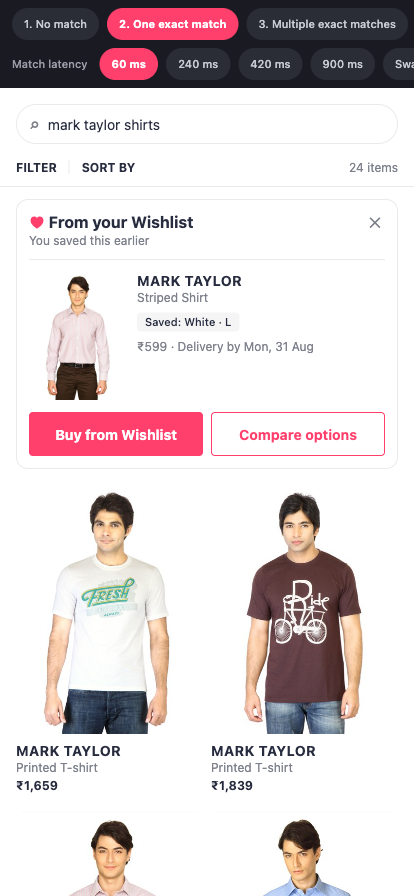
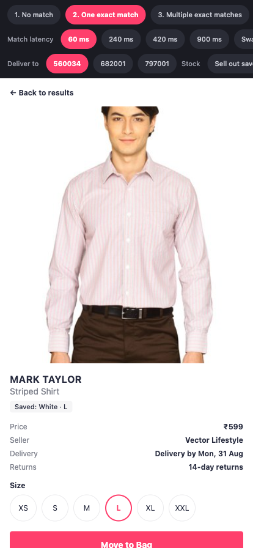
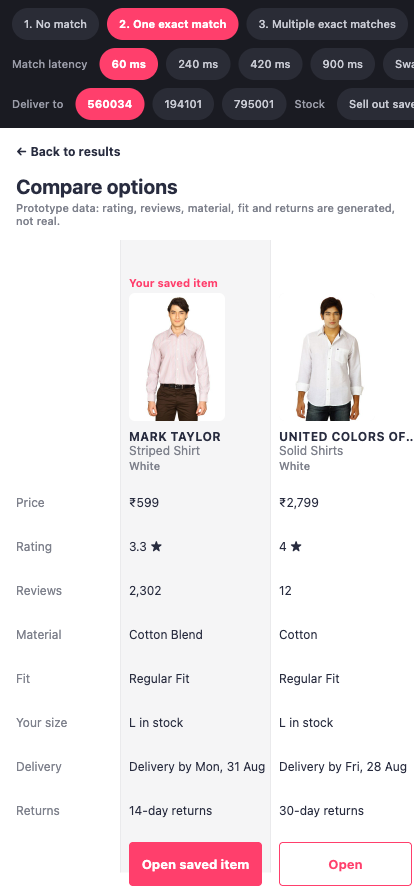

# Wishlist Search-Reconnection — prototype

A buildable prototype of the "From your Wishlist" search-reconnection module
specified in [`Wishlist_Reconnection_MVP_Prototype_Plan.md`](./Wishlist_Reconnection_MVP_Prototype_Plan.md).

This repository covers **Slice 1** (the catalog pipeline, the identity and
variant graph, the match layer, and the module UI in all ten of its states) and
**Slice 2** (the Buy-from-Wishlist revalidation flow, E5, and the Compare view,
E6).

## Running it

```bash
python3 -m venv .venv && .venv/bin/pip install pyarrow pillow
.venv/bin/python tools/catalog/build.py --check     # builds the catalog (~2 GB of transfer, once)

cd app && npm install
npm test                                            # everything, including the gates
npm run gates                                       # acceptance gates → docs/gate-report.md
npm run shadow                                      # Phase 3 read-out → docs/shadow-report.md
npm run experiment                                  # E10 read-out → docs/experiment-report.md
npm run panel                                       # panel sizing → docs/panel-sizing.md
npm run web                                         # open the prototype
```

The dark bar at the top of the app is the **E12 state harness**. Every state
from section 4.6 of the plan is one tap, plus a match-latency control and the
swapped-fill treatment the plan defers to Phase 5. When the module is absent,
the harness says why — timed out, breaker open, dismissed, or resolved past the
render grace — so an intentional suppression is never mistaken for a broken build.

| | |
|---|---|
|  |  |
| **State 2** — one exact match | **State 5** — saved size gone. The primary action becomes "See available sizes": no dead-end Buy, no silent substitution. |
|  |  |
| **E5** — the saved product, colour and size preselected, all five facts revalidated at the boundary | **E5 recovery** — stock moved between the module render and the tap. Named state, saved variant untouched. |
|  | |
| **E6** — the saved item first and labelled, against four query-relevant alternatives on eight axes. No discount column. | |

## Acceptance gates

The plan attaches a `✅ Gate` line to every P0 epic. Five of them are things
code can measure, and `npm run gates` measures them, writing
[`docs/gate-report.md`](docs/gate-report.md):

| Epic | Requirement |
|---|---|
| E1 | exact-match precision ≥ 99% over a 500-pair set |
| E1 | zero silent variant substitutions across a 10,000-run fuzz |
| E2 | ≥ 90% field-level parser accuracy over 1,000 queries |
| E3 | match p95 ≤ 120 ms |
| E8 | no wishlist field in any unauthenticated response **or log line** |

The report records what each number **is not evidence for**, alongside the
number. That column is the point. The E1 labels are generated rather than
hand-labelled, and the generator derives brand the same way the matcher does,
so an error shared by both cancels out — a passing precision figure guards
against regression but is not the Phase 1 exit evidence the plan asks for. The
latency figure is in-process JavaScript, not the 500 rps load test. A gate
report that omitted those caveats would be worse than no gate report.

Two of the three P0 gaps the gates exposed were invisible to every unit test:
tier 2 matching never fired at all (dead code behind a passing suite), and the
identity floor gated the colourway being drawn rather than the saved one, so an
item too untrustworthy to show could still surface a sibling colour.

## Shadow mode and the metric pipeline (E9)

`npm run shadow` writes [`docs/shadow-report.md`](docs/shadow-report.md): the
Phase 3 read-out the plan's S8–S9 ask for. In the app, the harness has a
**Shadow mode** toggle — matching runs in full and is logged in full, and the
user sees nothing. That is the only way to measure opportunity volume before
launch, and the distinction the implementation cares about is between "found
nothing" and "found something and withheld it".

All eleven metrics from §7 are pure functions of one append-only event log
(`analytics/metrics.ts`), including the primary 30-day **user-level** cohort
rate. Users whose window has not closed are censored rather than counted as
failures — counting them would depress the rate and then let it drift upward
for a month, which is indistinguishable from a real effect.

The report keeps its two halves apart, because conflating them is the easiest
way to mislead someone with it. **The shadow run is real** — the actual matcher
over the committed catalog, producing genuine opportunity volume and a genuine
τ sweep. **The metric read-out is simulated**, because a greenfield prototype
has no users; the population is synthetic and its lift was planted by hand. The
cohort model is validated by checking it recovers that planted lift — a model
that cannot find an effect you planted will not find one you did not.

The τ sweep currently **declines to recommend a change**. Precision is already
100% at the lowest threshold tested, so the sweep never observes τ doing any
work; the hard predicates absorb the false positives this eval set contains.
Reading that as "τ can safely come down" would treat an absence of evidence as
evidence of absence.

## Panel sizing — the open decision

The plan guesses 300–500 recruited testers (§7.4) and nothing had checked it.
[`docs/panel-sizing.md`](docs/panel-sizing.md) does.

**A panel of 400 cannot answer the primary question, and cannot answer the
B − A question at all.** Detecting a 5pp lift needs ~11,600; establishing
whether variant continuity is the mechanism needs ~73,700.

The gap is not the sample-size formula. It is three multipliers between a
recruited person and a usable observation: the panel splits three ways before
anything happens; a treatment user who never sees the module behaves like
control, so the observed effect is scaled by exposure and sample size scales
with its square; and B − A is a *smaller* effect than either arm's lift,
measured between two treatment groups rather than against the whole control.

The sizing is validated rather than asserted — at the computed size, 2,000
simulated experiments detected the effect 79.1% of the time against a target of
80%, and 35.7% at half that size.

**What a 300–500 panel is right for:** whether participants understand why the
module appeared, whether they recover from an unavailable variant, whether the
ten states read correctly, and §4.4's swapped-fill check. Those are usability
questions with usability sample sizes, and this prototype can answer them now.

## User controls and durable personalisation (E16)

Three things, and the third carries a conflict worth naming rather than
resolving quietly.

**The global setting** (§4.16) — enforced service-side, from Slice 3.

**Per-item hide** — durable, and deliberately *not* the same control as
dismissal. FR-8 is explicit that dismissing is a relevance signal and "never a
permanent opt-out": it lasts for the query family and the session. Hiding is the
permanent one, reached by escalating from a dismissal rather than by tapping a
close box, and it is enforced in the matcher so the view is not the only thing
honouring it. Every durable control gets an undo, or it is a trap.

**Preferred-action learning — built, and deliberately not applied.** E16 asks
for it. FR-5 and §4.4 require the two actions to stay co-equal, with neither
visually subordinate. Reordering or re-emphasising the buttons cannot honour
both.

It is worse than a design conflict during the experiment. §7 splits Treatment A
from B precisely to learn *where* a lift comes from, read off the
Buy-from-Wishlist and Compare-options rates. Personalising which action leads
would turn those rates into a measurement of the personaliser. So the preference
is learned and recorded — durably, and while the experiment runs — but
`shouldPersonalise()` refuses to apply it whenever an experiment is active, and
it stays off by default besides. Acting on the learning is a decision for after
the read-out, not a default.

The learning also refuses to claim a preference on thin evidence: six actions
minimum, and a 65% margin. Two taps is a coincidence, and a personalisation that
fires on noise is worse than none because the user cannot tell it from the
product being erratic.

## Duplicate reconciliation (E14)

FR-11 asks for three duplicate states — in Bag, Save for Later, purchased
before — to be **detected and re-labelled**. Detection is the operative word.
Until this slice, `in_bag` and `purchased` were fields on the wishlist record,
which is an item asserting something about itself. An assertion cannot go stale
correctly: remove something from your bag and the saved item goes on claiming
to be in it.

So the states are derived from the records that own them (`commerce/reconcile.ts`):
the wishlist says what you saved, the bag says what you are about to buy, the
order history says what you already did. Precedence runs in-bag → Save for Later
→ purchased, because in-bag is the only one where the user is about to do
something wrong *right now*.

Two distinctions the derivation makes that a flag could not:

- **Purchased in a different size or colour** is its own state. For fashion that
  is usually a sizing story rather than a repeat purchase, and it deserves
  different copy.
- **Duplicate-add** means exactly one thing — the same SKU is already in the bag.
  Having bought it last year is not a duplicate add, and the §7 duplicate-add
  metric depends on that being precise.

Adding from the wishlist takes the item out of Save for Later, because leaving
it in both would make the next reconciliation ambiguous.

## Multi-match ranking (E13)

Matching and ranking answer different questions, and the prototype had been
using one answer for both. The match score asks *is this the right item*.
Ranking asks *which of the right items is most useful to show now* — and the
dominant signal there is not confidence, it is whether the thing can actually
be bought. Sorting by raw score put an unbuyable item above a buyable one
whenever it happened to score higher.

So `match/ranking.ts` deliberately does **not** re-weight the scoring signals —
recency and confidence are already priced into the score, and re-applying them
would double-count. What ranking adds is actionability, diversity and a total
order:

- A buyable item leads. In-bag and previously-purchased rank below it but above
  nothing, because "you already have this" is the duplicate purchase FR-11
  exists to prevent. An unavailable variant ranks last and is still shown —
  the user saved it, and learning it is gone beats silence.
- **One slot per product.** Two colourways of the same shirt are the same
  memory twice, and FR-3's cap of three is too small to spend that way.
- A per-brand cap that applies only while a different brand is waiting, so a
  wishlist that genuinely is all one brand still fills its slots.
- Deterministic to the last comparison. A module that reshuffles between two
  identical searches is disorienting on its own, and during an experiment it
  would add variance to every interaction metric for nothing.

## The experiment harness (E10)

`npm run experiment` writes [`docs/experiment-report.md`](docs/experiment-report.md).
The harness bar carries an arm selector, the ramp, and a kill-switch drill.

**Assignment** is a pure function of user id and salt — no storage, no session
state. Two properties carry the experiment and both fail silently:

- *Stability.* A user who saw the module on Monday sees it on Tuesday.
- *Monotonicity.* Raising the ramp from 5% to 20% only ever **adds** users.
  Exposure and arm are hashed independently, so nobody already assigned can
  move. The obvious implementation — bucket into arms, then take the first N%
  of each — looks right and reshuffles at every step, restarting the experiment
  with no visible symptom. The report measures it: **0 of 13,182** exposed users
  moved across the full ramp.

**The three guardrails** from §7 flip the flag with no human in the loop:
search-to-purchase rate, latency p95, error rate. The switch is *sticky* — it
stays tripped once numbers recover, because a treatment that recovers on its own
would flap in and out of the population. Clearing it restores the arms users
already had. A minimum sample applies to every guardrail: a switch that fires on
nine sessions gets disabled by the first person it wakes.

**Sequential inference**, because a staged ramp means looking repeatedly and a
fixed-horizon test is valid only if you look once. The report measures the cost
on data with no effect at all: peeked 40 times, a fixed-horizon test declares
significance **33.7%** of the time against a nominal 5%. The confidence sequence
holds at 2.3%. Its intervals are wider at every moment, and that width is the
price of being allowed to stop whenever you like — cheaper than the alternative,
which is not a narrower interval but an invalid one.

**Control is gated in the service**, not in the view: it runs the match and logs
it, so the counterfactual is measurable, and renders nothing. Assignment that no
code consults is decoration.

## Two-phase freshness

The availability the module renders is **advisory** — true when the match
resolved, possibly not true now. The binding read happens at the action
boundary, in `revalidation/revalidate.ts`, and is allowed to contradict the
card the user just tapped. That disagreement is the point, so the harness can
force it: **Sell out saved size**, **Sell out product** and the delivery
address selector each drive a different named recovery state.

Blocking reasons are named rather than generic, because each has a different
next step: a sold-out size, a withdrawn product, and an unservable address are
not the same conversation. Advisories (price or seller changed) are stated as
facts with no direction of travel — "it went down" would be an incentive, which
constraint C-1 rules out.

## Where the data comes from

The plan names the Kaggle *Fashion Product Images (Small)* dataset. Three
things about it shape the pipeline, and all three were verified rather than
assumed:

- **There is no `brand` column.** Brand lives inside `productDisplayName`, as
  the token span before the first gender token. The rule recovers 98.4% of
  rows; the rest fall back to a gazetteer bootstrapped from the ones that
  parsed, and what still fails is dropped rather than guessed.
- **There is no size, price, seller, stock or SKU.** All of it is synthesised
  from a SHA-1 of the SKU id, so the catalog is byte-identical on every machine.
- **The images are 60×80**, far too small for the 96×128 pt card. A mirror of
  the same 44,072 rows at 384×512 supplies the images instead.

Five of E6's eight comparison axes — rating, review count, material, fit and
returns — are also absent from the dataset and are synthesised. The Compare
screen says so on itself: a comparison invites a judgement, and a judgement
built on invented numbers is worth nothing unless the reader knows.

The dataset's own noise is kept on purpose. 1,122 rows have a colour in their
title that contradicts `baseColour` — "Carlton London Women **Black** Heels"
recorded as Bronze. Those get a low `identity_confidence` and are exactly the
mislabelled-listing case the plan's E1 exists to handle.

## Layout

```
tools/catalog/     the pipeline: fetch → derive → curate → synthesise → images
app/src/match/     contract, rules-based query parser, tier 1+2 matcher,
                   suppression, circuit breaker, fail-open transport
app/src/components/WishlistModule/   the module
app/src/harness/   the E12 state switcher
app/src/data/      generated — never hand-edit
```

## The constraints, and where they are enforced

| Constraint | Where |
|---|---|
| C-1 no monetary incentive | `copy/bundle.ts` ban list, asserted in `__tests__/copy.test.ts` |
| C-3 search never waits on matching | `search/localSearch.ts` takes no wishlist argument; `match/transport.ts` fails open inside 250 ms |
| C-4 precision over recall | Below τ returns empty, never a weak card (`match/matcher.ts`) |
| C-5 no semantic similarity | Tier 3/4 are absent, not stubbed |
| C-6 no cross-account leak | Logged-out callers take the same path to the same frozen empty response |
| C-7 accessibility | Labels, focus order and ≥44×44 targets asserted in `__tests__/module.test.tsx` |
| FR-7 no silent substitution | An alternative is only ever offered once the saved variant is blocked, and buying a different size relabels the button with the size it is actually buying |
| C-8 higher bar for voice/image | Per-modality τ in `match/contract.ts` |
| §4.16 user control | `preferences.showWishlistInSearch`, enforced in `match/transport.ts` before the matcher runs — a preference the UI honours but the service ignores is not a control |
