# Wishlist Search-Reconnection — prototype

A buildable prototype of the "From your Wishlist" search-reconnection module,
built against three specs that are really one plan at three altitudes:

| Spec | What it is |
|---|---|
| [`Wishlist_Reconnection_MVP_Prototype_Plan.md`](./Wishlist_Reconnection_MVP_Prototype_Plan.md) | The engineering plan. Every epic is built except E15, which constraint C-5 forbids in v1. |
| [`Implementation Prompt_ Improve Myntra Wishlist Reconnection Prototype.md`](./Implementation%20Prompt_%20Improve%20Myntra%20Wishlist%20Reconnection%20Prototype.md) | Ten improvements on the deployed prototype, plus harness, analytics and validation requirements. |
| [`Myntra_Decision_Confidence_and_Comparison_Reentry_Wireframes.md`](./Myntra_Decision_Confidence_and_Comparison_Reentry_Wireframes.md) | The UX blueprint for improvements 1 and 8 — eleven wireframes, interaction rules, an edge-case matrix and measurement hooks. |

All ten improvements are built, plus a later feature spec on top. The
reconnection module answers *"did I save this?"*; the Decision Confidence Layer
answers *"is it still right for me?"*; comparison re-entry means the answer
survives leaving the screen; and cross-category pairing answers the third
question a shopper actually has — *"what do I already own that goes with
this?"*

**Live:** https://wishlist-reconnection-prototype.vercel.app

546 tests, ten measured acceptance gates, four generated reports.

## Running it

```bash
python3 -m venv .venv && .venv/bin/pip install pyarrow pillow
.venv/bin/python tools/catalog/build.py --check     # builds the catalog (~2 GB of transfer, once)

cd app && npm install
npm test                                            # everything, including the gates
npm run gates                                       # acceptance gates → docs/gate-report.md
npm run shadow                                      # Phase 3 read-out → docs/shadow-report.md
npm run experiment                                  # E10 read-out → docs/experiment-report.md
npm run panel                                       # panel sizing → docs/panel-sizing.md
npm run web                                         # open the prototype
```

The dark pill above the bottom nav opens the **E12 state harness**. Every state
from section 4.6 of the plan is one tap, plus match latency, delivery pincode,
stock controls, shadow mode, the four experiment arms, the ramp and kill switch,
the later-phase surfaces, and the swapped-fill treatment the plan defers to
Phase 5. When the module is absent, the harness says why — timed out, breaker
open, dismissed, or resolved past the render grace — so an intentional
suppression is never mistaken for a broken build.

The pill is **on under `npm run web` and off in a deployed build**, so a link
sent to a participant or a stakeholder carries no research chrome. Add
`?harness=1` to get it back — the answer is remembered for the rest of the
browser tab, because the app rewrites its own URL as it navigates and would
otherwise drop the flag on the first tap. `?harness=0` turns it off again. A
native build always has it: there is no URL there to carry a flag.

| | |
|---|---|
| 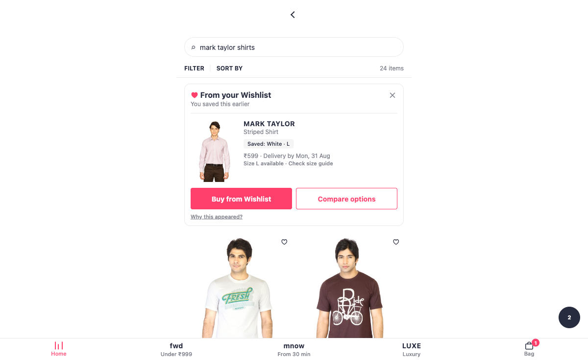 | 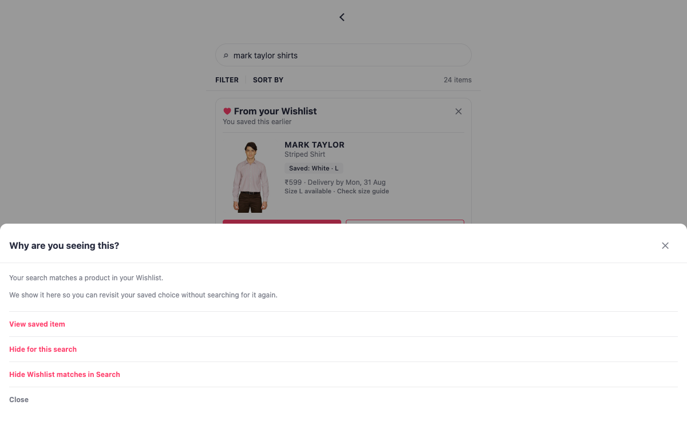 |
| **DC-01** — the module with its compact confidence summary. Saved variant, availability, delivery, and the one fit statement this catalog can support. | **DC-02** — the explanation, and both controls. Hiding for this search is a relevance signal; hiding always is the durable setting. Neither mentions why the item was saved. |
| 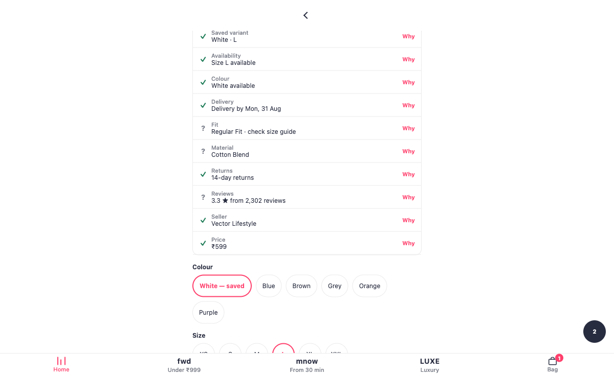 | 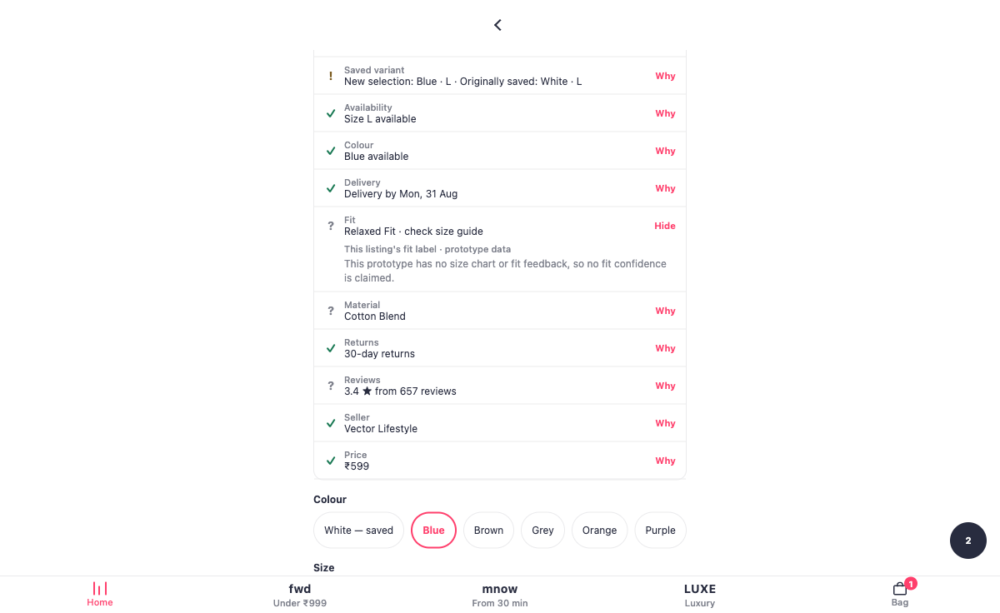 |
| **DC-03/04** — ten signals, each with a "Why" that names its source. `?` means no verdict is claimed, not that data is missing. | **DC-06** — switch colour and the saved variant stays visible as a reference. The signals re-read from the colour on screen, never from the saved one. |
| 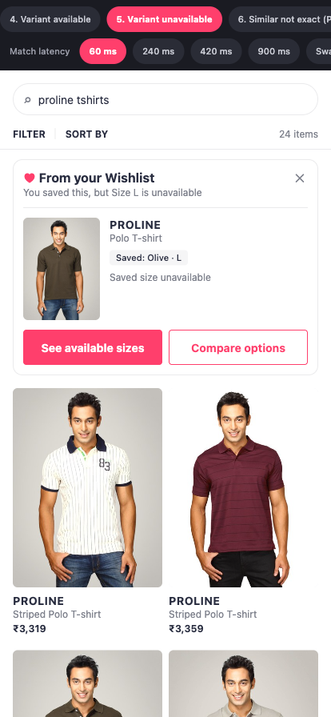 | 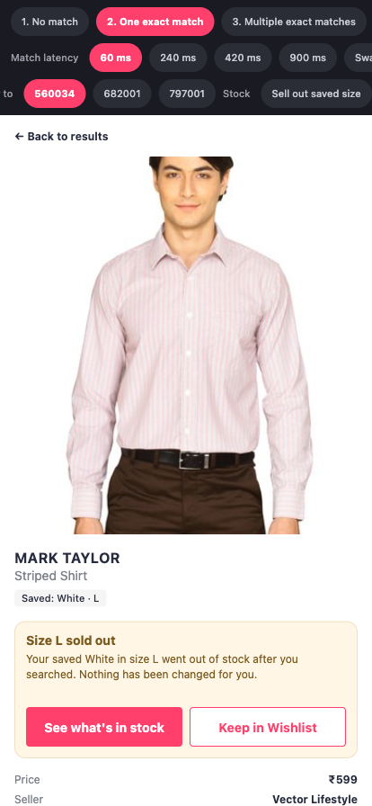 |
| **State 5** — saved size gone. The primary action becomes "See available sizes": no dead-end Buy, no silent substitution. | **E5 recovery** — stock moved between the module render and the tap. Named state, saved variant untouched. |
| 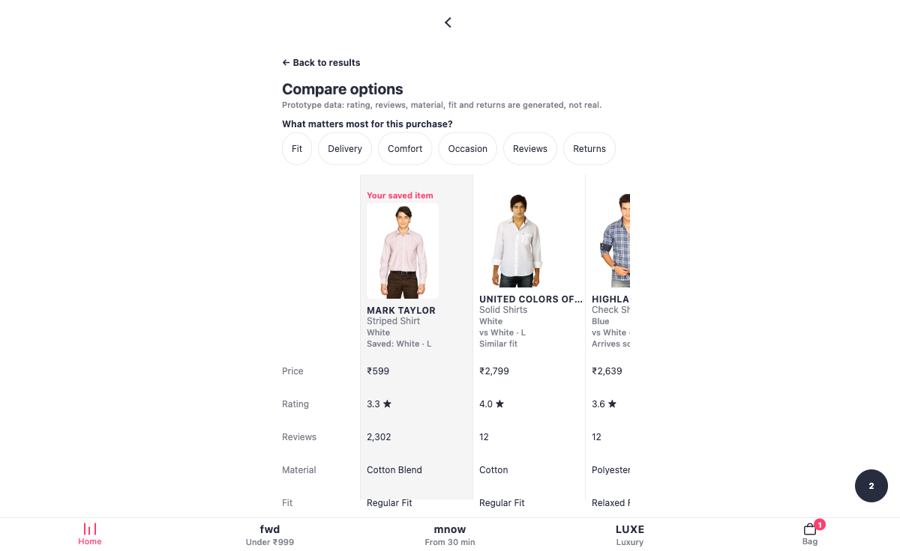 | 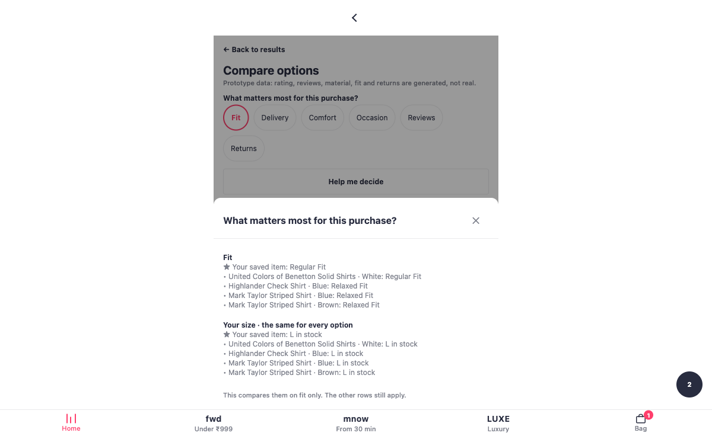 |
| **Compare** — a priority reorders the rows and hides none, with a derived reason line per alternative and the saved variant as the anchor. | **Help me decide** — restates the evidence on the chosen axes, marks any axis that separates nothing, and names no winner. |
| 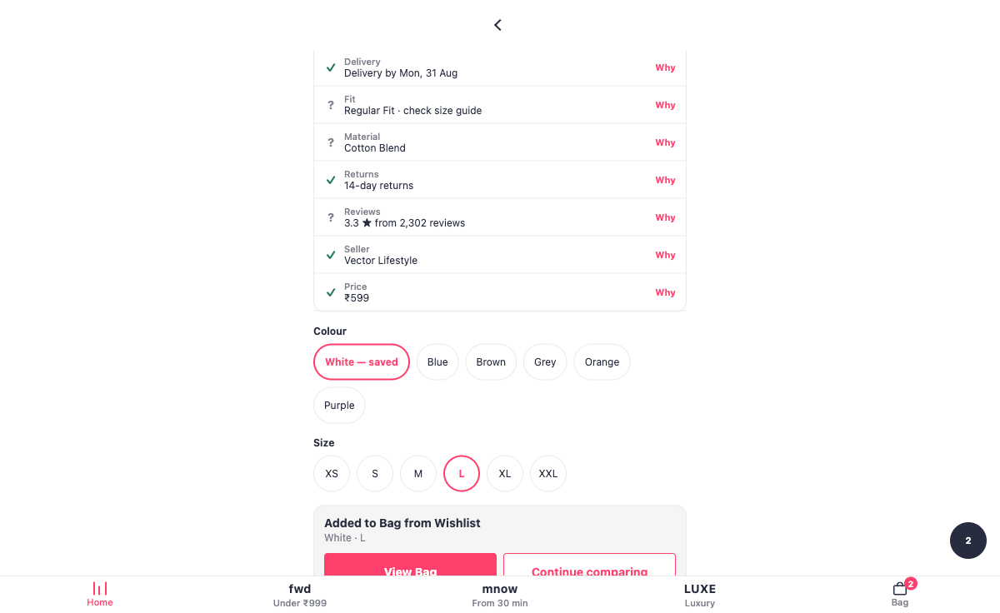 | 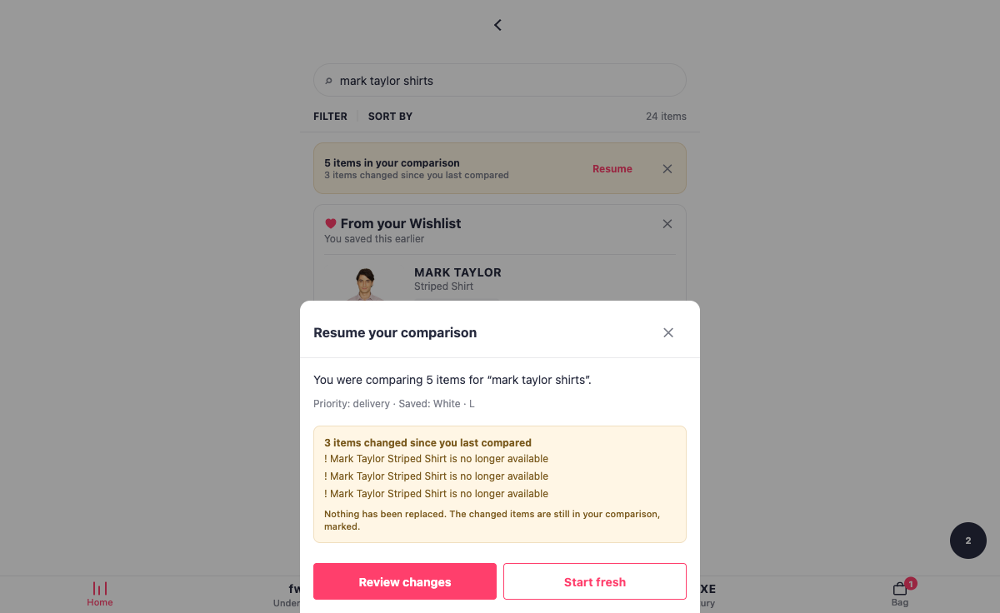 |
| **Improvement 3** — the add is a decision point with three real next moves, not a toast that vanishes in 2.6 seconds. | **CR-02/05** — the quiet resume bar, and the sheet naming what changed before the user commits to going back. |
| 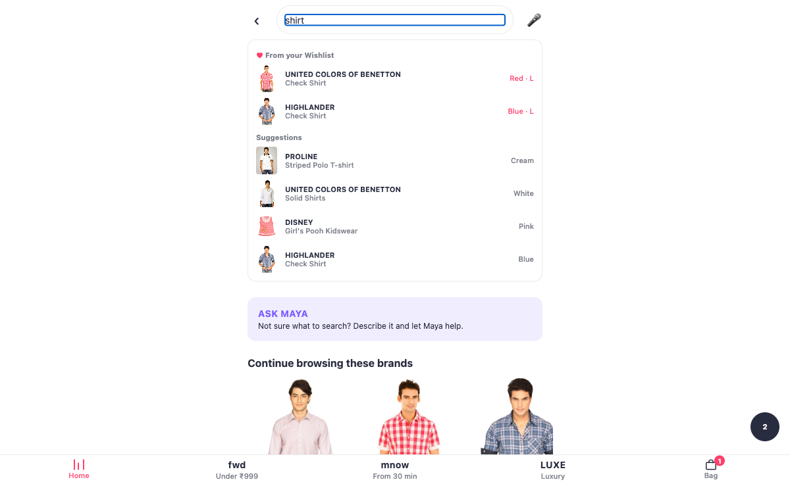 | 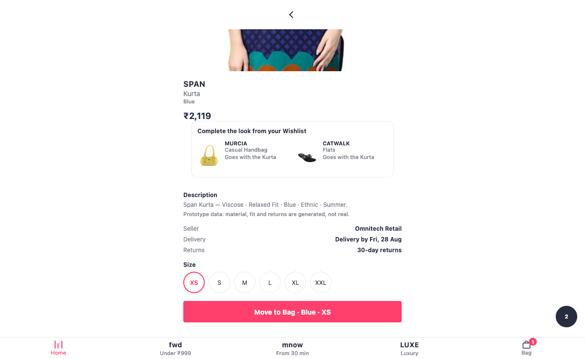 |
| **Typeahead** — saved matches above organic suggestions, composed as layout rather than as ranking so FR-2 stays structural. The saved group is fail-open and simply absent if matching misses. | **Complete the look**, headed *Style it with your saved items* — price, then the pairing, then the description. A women's Kurta pairs with the saved Handbag, Flats, Earrings and Belt: an ensemble the old pairwise table could never find. |

## The Decision Confidence Layer

A confidence signal is a value, not a string, and the reason is section 7 of
the wireframes: *"Size guidance is based on this brand's size guide"* beats an
unexplained *"High fit confidence"*. So `source` is mandatory on every signal
and `synthetic` is not optional either — five of the fields this panel reads
are SHA-1 synthesised by the catalog pipeline, and presenting those as real
marketplace data is forbidden outright.

Everything derives from `RevalidationResult`, the *binding* read. The module's
compact summary is advisory and is allowed to be contradicted a tap later;
that disagreement is two-phase freshness working, not a bug.

**`status: "unknown"` is a first-class outcome**, and fit is permanently one.
This catalog has no size chart, no measurements and no fit feedback — the fit
label is itself generated. A fit *score* here would be the clearest possible
case of dressing invented data as evidence, so the panel says it claims no fit
confidence and points at the size guide. Reviews are the same: the count and
the average are stated, and no verdict is drawn from them, because section 6
asks for review coverage to be distinguished from a quality judgement.

Four things the improvement prompt implies that the data cannot support, and
which are therefore **not** built: stock depth, a real size guide, review
quality as distinct from count, and seller trust signals. Each is named in the
plan rather than quietly approximated.

## Comparison, made a decision rather than a table

**A priority reorders and never filters.** Improvement 4 asks for reordering
"without hiding important information", and the distinction is the design:
hiding the rows a user did not prioritise would decide for them which
trade-offs are allowed to exist. Price stays on screen at every priority — but
it is not a priority anyone can pick, because that is where monetary logic
would re-enter a comparison C-1 keeps it out of.

**"Comfort" is not a column** and does not pretend to be one; it reads material
and fit together. "Occasion" is backed by `usage` and `season`, which are real
dataset columns.

**Why an option appears is derived or absent, never generated.** Every reason
compares fields that exist — parent id, brand key, article type, name core, fit
label, delivery date — and an option matching none of them gets no line at all.
Two null fit labels are explicitly not a similarity: an absence of data is not a
match. A user who reads a false reason learns the whole panel is decorative.

**"Help me decide" does not decide.** It restates what the table already says
on the axes the user picked, marks any axis that fails to separate the options,
and closes with a line that cannot name an item. Any ranking would be an
opinion dressed as arithmetic, built on five synthesised fields and handed to
someone who asked for help — which improvement 5 rules out in as many words.
It is off by default, so it is never a third action competing with the two FR-5
requires stay co-equal.

## Comparison re-entry (Part B)

Session-first, per section 11: no durable comparison history in v1, because
that adds privacy and clutter questions before the core behaviour is validated.

**The session pins which items were compared and never what they said.**
`CompareScreen` re-derives its columns on every mount, so persisting the
rendered values would let a resumed comparison drift out of date — and E14
already taught this codebase that caching a derivation reproduces the staleness
the derivation exists to remove.

**But a baseline is not a cache.** Answering "what changed since you last
compared" needs the prior answer, and that is a different thing: an immutable
historical fact rather than a value that goes stale. Without one, an option that
was *already* out of the user's size when they compared it reports as changed,
and the recovery affordance cries wolf on the first resume. A test caught
exactly that.

**Getting here required fixing what a session is.** `session_id` was
`sess_${seq}` and `seq` increments per search, so the two ideas were the same
string — which made "hidden for this session" mean "hidden until you type
again", a live FR-8 violation, and would have thrown away a resumable
comparison at exactly the moment CR-02 needs one. One existing test had the
defect written down as a requirement. Splitting the ids moved what `session_id`
means to `searchToPurchaseRate`, a *guardrail*, so it groups on the search now
and keeps counting what it always counted; the reports regenerate identically,
which is how that was verified rather than asserted.

## Later-phase surfaces, honestly labelled

All off by default, all out of the primary experiment.

**Intent tags** are optional, added after the save rather than in front of it,
and never inferred — the store has no input but explicit calls, which is the
structural version of "do not infer sensitive personal occasions". At most one
line surfaces per card, in canonical order so it cannot reshuffle between
identical searches. Display is a preference, because "the user wrote it
deliberately" and "safe on a screen a flatmate can see" are different questions.

**Look completion** is capped at two and draws only from items already saved.
With nothing suitable saved it renders nothing rather than reaching into the
catalog — suggesting something the user never chose is the basket-size
recommender the prompt forbids.

**Voice, category/brand and Ask-Maya are real**: the same exact matcher and
rules parser at a stricter threshold, which the contract has keyed per modality
since Slice 1 (C-8). The ladder is measured rather than claimed — on the real
catalog, "shirt" matches three items under text and **zero** under voice, and
"blue jeans" sits between the voice and image bars.

**Image is not real, and says so on the chip.** Visual similarity is Tier 4;
C-5 excludes Tier 3 and 4 from v1, and E15 is the one epic in the whole plan
left deliberately unbuilt for that reason. Building an embedding path to
satisfy a later-phase checkbox would quietly undo the constraint the entire
precision story rests on, and the false positives are exactly what C-4 calls
worse than misses. A stub that admits what it is beats a demo implying a
capability the system does not have.

## Cross-category pairing, and a product page to put it on

The third question a shopper has, after "did I save this?" and "is it still
right for me?": **what do I already own that goes with this?**

### Slots, not pairs

The complement table this replaced was O(types²) to maintain and had already
rotted in silence. Four of its ten pairs named article types the catalog does
not contain, so `Kurtas` mapped only to `Leggings` and could never fire, and
**thirteen of twenty-one types returned nothing at all**.

An outfit is modelled as slots instead — `top`, `bottom`, `full_body`, `feet`,
`carry`, and the five finishing slots `waist`, `wrist`, `eyes`, `jewellery`
and `beauty` — and two items complement each other when their slots differ. A
new article type joins by being assigned one slot. That is the whole cost of
extending it.

One exception is why the model earns its keep: **`full_body` conflicts with
both `top` and `bottom`**, because a dress already occupies the torso and the
legs. A pairwise table gets that wrong unless somebody remembers to think of it.

It fixed the demo as well as the maintenance. A saved Kurta paired with nothing
before; under slots it pairs with the saved Handbag and Heels — a women's
outfit the wishlist has contained all along and the shipped code could not find.

### An ensemble, not a companion

One `finishing` slot once held every accessory, on the rule that "two
finishing touches are not a look". That rule was the density bottleneck: a
belt and a watch are worn at once, on different parts of the body, and a
single slot meant a men's shirt could reach one of them and a kurta could show
earrings or a watch but never both. The accessories now hold the slot they
actually occupy — `waist`, `wrist`, `eyes`, `jewellery` — while the half of
the rule worth keeping survives one slot deep: still no two belts, and
cosmetics and fragrance stay together in `beauty` so a lipstick and a nail
polish cannot take the seats the garment needed.

The cap moved with it, from three suggestions to **four** — the smallest that
holds a dressed look: the other garment, footwear, and something carried or
worn with it. Four is still a capped strip of saved items rather than a
carousel; it wraps into two columns rather than squeezing a fourth card into a
row built for two.

Seating and display are now two different orders, because they answer two
different questions. **Seating** asks which slots are worth one of the four
places, and the answer is the outfit's — garment, then footwear, then the bag,
then the accessories, with beauty last. Ordering seats by save date filled the
strip with whatever was saved most recently; ordering them by buyability
dropped the saved Flats, the only women's footwear in the wishlist, behind
four buyable accessories and left the outfit barefoot. **Display** asks what
leads, and there the old rule holds: an item the user can no longer buy is
still worth showing, but never first — and it now says `No longer in your
size` on the card rather than letting the user find out at the size selector.

Measured over every catalog product as a seed, the 427 seeds that produce a
look average **3.59 distinct categories** each, up from 2.20: 254 of them
reach four items, 173 reach three. The other 108 seeds suggest nothing, and
that is data rather than engine — see the caveat below.

### Where the code and the design canvas disagree

`Myntra MVP.dc.html` is the design spec for this app, and the code no longer
matches it in three places. All three are deliberate, and recorded here rather
than left to be discovered as bugs:

| The canvas says | The app does | Why |
| --- | --- | --- |
| `wear.io` wordmark | **Myntra** | The visual system was matched to the predecessor prototype (`~/Documents/Prototype_MVP`), branding included. The *name* only: the mark beside it is drawn, per `shell/MyntraMark.tsx` — "the logo itself is not ours to reproduce". |
| `Under ₹999` · `From 30 min` · `Luxury` | **Explore · MNow · Luxe** | Same tabs, same destinations, Myntra's own product names. |
| `image-slot id="cat-Fashion"` | Drawn category glyphs | The slot wants category artwork; we have no illustration source, so the marks are composed from Views like the shell's other glyphs. |

The palette and type scale also now follow the predecessor's
`tailwind.config.ts` rather than the screenshot transcription the tokens file
began as — `#141414` ink over Myntra's real `#282C3F`, half-point type sizes.
That is a preference for the predecessor's look, not a correction, and
`design/tokens.ts` says so.

### What the section is called, and what it says

The feature is "complete the look" everywhere it is named internally —
`wishlist/lookCompletion.ts`, the harness toggle, this section. The heading a
shopper reads is not, and the two surfaces do not share one:

| Surface | Heading | Why |
| --- | --- | --- |
| Product page | **Style it with your saved items** | `LOOK_HEADING_PDP`. The garment is already on screen, full width, directly above. With nothing left to disambiguate, the heading can address the person rather than point at the item. |
| Search | **From your Wishlist, to go with this** | `LOOK_HEADING`. Here "this" is one result among several, so the heading has to point before it can say anything else. |

Neither can get warmer than that by much. C-1 bans the register that usually
passes for catchy — `BANNED_COPY_PATTERNS` rejects urgency and deal language —
and `__tests__/copy.test.ts` sweeps every exported string in the bundle to
enforce it, including strings added long after that test was written.

### Three gates that reject rather than score

A wrong suggestion costs more than a missing one, so each gate rejects.

**Gender coherence** exists for a specific trap in this catalog: gender is
perfectly confounded with article type, and `Tops` and `Dresses` are tagged
**Girls**, not Women. So the most natural-looking pair in the whole dataset —
Dresses with Heels — silently crosses kidswear into adult footwear. Nothing
about the article types reveals that.

**Usage coherence** keeps sportswear out of formalwear, over a real dataset
column. **Lifecycle** runs through `commerce/reconcile.ts` rather than a flag,
so an item leaving the bag becomes eligible again — the property a stored flag
could not deliver.

Suggestions are drawn **only from the user's own wishlist**, never the catalog.
Reaching into the catalog would turn a memory feature into the basket-size
recommender the improvement prompt forbids, so when nothing saved fits, the
section is absent.

### Two new surfaces

**The product detail page** did not exist. Search tiles were not tappable at
all, Home routed to a stub and discarded the tile, and Browse turned a tile
into a search query — every product-shaped route required a wishlist item id,
so the pairing had nowhere to live. Section order is the spec's: price, then
the pairing, then the description.

**The description is composed, not written.** No description field exists
anywhere in the data model and the raw dataset has no copy column, so it is
assembled from material, fit, colour, usage and season, and labelled. Inventing
a paragraph of marketing tone would be the one genuinely dishonest thing that
screen could do — a shopper cannot tell invented tone from a real description.

**The typeahead** shows saved matches above organic suggestions. The two groups
are composed at the component level and never inside `search()`, because
`__tests__/search.test.ts` enforces FR-2 by reading the ranker's own source for
the words *wishlist*, *saved* and *match*. That test still passes **unmodified**,
which was the tripwire: if it had needed editing, the design had drifted into
organic ranking and should have stopped.

The saved group is fail-open. If the match call misses its grace period the
dropdown simply shows organic suggestions — a typeahead that waited on matching
would breach C-3 in the surface where latency is most visible, between two
keystrokes.

### What the catalog cannot demonstrate

The engine is universal; the demo is not, and the gate's caveat says so rather
than letting "0 violations across 497 suggestions" read as broader coverage
than it has.

The request that prompted this named *trousers* and *watches*: bottomwear here
is Jeans and Track Pants. Watches now exist — along with belts, sunglasses and
wallets — but as **browse-only** stock, so the caveat moves rather than
disappearing. Nothing in that range is saved, and pairing draws only from
saved items, so a browse-only watch can be found, opened and paired *from*,
never suggested. The saved wardrobe since filled the accessory slots, so the
shipped wishlist demonstrates two full ensembles — men's shirt → jeans → belt
→ watch, and women's kurta → handbag → flats → earrings → belt. Footwear is
missing from the men's chain for a reason worth knowing: the only men's shoes
saved were already bought, and the lifecycle gate is doing its job. Girls'
items have nothing saved to pair with, Boys have T-shirts only, no adult
bottomwear is saved for women, and Home is excluded by design.

There are no earphones, and there cannot be: the source dataset is fashion
only — Apparel, Accessories, Footwear, Personal Care — with no audio or
electronics row in any of its 42,426. Inventing one would put a fabricated
product in front of a participant, which is the line the `synthetic` flag
exists to hold.

## Acceptance gates

The plan attaches a `✅ Gate` line to every P0 epic. Nine things code can
measure, and `npm run gates` measures them, writing
[`docs/gate-report.md`](docs/gate-report.md):

| Epic | Requirement |
|---|---|
| E1 | exact-match precision ≥ 99% over a 500-pair set |
| E1 | zero silent variant substitutions across a 10,000-run fuzz |
| E2 | ≥ 90% field-level parser accuracy over 1,000 queries |
| E3 | match p95 ≤ 120 ms |
| E8 | no wishlist field in any unauthenticated response **or log line** |
| E13 | cap, one slot per product, usefulness ordering, stable order |
| DC | every signal cites a source; every generated field is labelled as such |
| CR-05 | every changed compared item is marked, and no unchanged one is |
| C-7 | every control labelled, every touch target ≥44pt |
| Pairing | no suggestion crosses gender, clashes a slot, resurfaces a bought item, or comes from outside the wishlist |

**E1 precision is currently red, and the number it was green on was luck.**
Adding the browse-only accessories moved the catalog, and the labelled-pair
sampler indexes by position — so only 1 of its 500 pairs survived the change
and the whole eval set resampled. Measured at sample sizes where the estimate
settles, the catalog *with* accessories scores better than the one before it:

| pairs | before accessories | with accessories |
|---|---|---|
| 500 (shipped) | 99.46% | **98.91%** |
| 2,000 | 98.50% | 99.05% |
| 8,000 | 98.49% | 99.22% |

So this is not a regression; it is a gate whose published figure rode on 184
rendered results, where one more hard case moves it half a point. The failure
mode underneath is identical in both and predates the accessories: a positive
whose saved variant is out of stock in every size renders tier 1 rather than
tier 2 — 44 such cases on the *old* catalog at 8,000 pairs. Whether that is a
matcher defect or a mislabel is a real question (`SavedItemCard` renders
"Saved size unavailable" by design, which argues the label is wrong), and it
is open.

The sample size has deliberately **not** been raised to clear the bar. That is
the move this codebase already talked itself out of once, in the cohort-test
episode below: inflating the population until a marginal effect passes answers
a question about power with a fact about the ramp.

Each new gate was **confirmed to fail against a planted violation** before it
was trusted. A gate nobody has watched fail is a gate nobody should trust, and
this codebase has produced enough measurements that could only come out one way
to make that a rule rather than a nicety.

**C-7 has been a launch gate in the plan since day one and had no gate behind
it** — its only measured assertion lived inside `module.test.tsx` and covered a
single hit target. The gate found a real defect on its first run: the colour and
tag pills carried `minHeight` but no `minWidth`, unlike the size pills beside
them, so a short colour name could render a target narrower than a fingertip.

It also produced fourteen false positives on that first run, which is worth
recording rather than quietly tuning away. React Native stretches a column
child by default, so a static check cannot tell a self-sizing pill from a
full-width row without seeing the parent. The rule now measures only elements
that declare a width, and the caveat says the number is a floor rather than a
proof instead of implying a rigour it does not have.

The report records what each number **is not evidence for**, alongside the
number. That column is the point. The E1 labels are generated rather than
hand-labelled, and the generator derives brand the same way the matcher does,
so an error shared by both cancels out — a passing precision figure guards
against regression but is not the Phase 1 exit evidence the plan asks for. The
latency figure is in-process JavaScript, not the 500 rps load test. A gate
report that omitted those caveats would be worse than no gate report.

Two of the three P0 gaps the gates exposed were invisible to every unit test:
tier 2 matching never fired at all (dead code behind a passing suite), and the
identity floor gated the colourway being drawn rather than the saved one, so an
item too untrustworthy to show could still surface a sibling colour.

## Shadow mode and the metric pipeline (E9)

`npm run shadow` writes [`docs/shadow-report.md`](docs/shadow-report.md): the
Phase 3 read-out the plan's S8–S9 ask for. In the app, the harness has a
**Shadow mode** toggle — matching runs in full and is logged in full, and the
user sees nothing. That is the only way to measure opportunity volume before
launch, and the distinction the implementation cares about is between "found
nothing" and "found something and withheld it".

All eleven metrics from §7 are pure functions of one append-only event log
(`analytics/metrics.ts`), including the primary 30-day **user-level** cohort
rate. Users whose window has not closed are censored rather than counted as
failures — counting them would depress the rate and then let it drift upward
for a month, which is indistinguishable from a real effect.

The report keeps its two halves apart, because conflating them is the easiest
way to mislead someone with it. **The shadow run is real** — the actual matcher
over the committed catalog, producing genuine opportunity volume and a genuine
τ sweep. **The metric read-out is simulated**, because a greenfield prototype
has no users; the population is synthetic and its lift was planted by hand. The
cohort model is validated by checking it recovers that planted lift — a model
that cannot find an effect you planted will not find one you did not.

The τ sweep currently **declines to recommend a change**. Precision is already
100% at the lowest threshold tested, so the sweep never observes τ doing any
work; the hard predicates absorb the false positives this eval set contains.
Reading that as "τ can safely come down" would treat an absence of evidence as
evidence of absence.

## Panel sizing — the open decision

The plan guesses 300–500 recruited testers (§7.4) and nothing had checked it.
[`docs/panel-sizing.md`](docs/panel-sizing.md) does.

**A panel of 400 cannot answer the primary question, and cannot answer the
B − A question at all.** Detecting a 5pp lift needs ~19,400; establishing
whether variant continuity is the mechanism needs ~122,800.

The gap is not the sample-size formula. It is three multipliers between a
recruited person and a usable observation: the panel splits five ways before
anything happens; a treatment user who never sees the module behaves like
control, so the observed effect is scaled by exposure and sample size scales
with its square; and B − A is a *smaller* effect than either arm's lift,
measured between two treatment groups rather than against the whole control.

**Every arm costs a third more panel**, and the number is published rather
than absorbed:

| | 5pp lift | B − A |
|---|---|---|
| Three arms | 11,634 | 73,673 |
| + treatment C (confidence) | 15,512 | 98,230 |
| + treatment D (pairing) | **19,390** | **122,787** |

That is the price of an answerable question rather than a regression. It is
stated because the alternative was a report that kept publishing a three-arm
sizing while the code ran four — and two places would have done exactly that:
`panel.report.test.ts` hardcoded its arm count, and the shadow report's metric
table had no column for the new arm at all.

The sizing is validated rather than asserted — at the computed size, 2,000
simulated experiments detected the effect 79.1% of the time against a target of
80%, and 35.7% at half that size.

**What a 300–500 panel is right for:** whether participants understand why the
module appeared, whether they recover from an unavailable variant, whether the
ten states read correctly, and §4.4's swapped-fill check. Those are usability
questions with usability sample sizes, and this prototype can answer them now.

## User controls and durable personalisation (E16)

Three things, and the third carries a conflict worth naming rather than
resolving quietly.

**The global setting** (§4.16) — enforced service-side, from Slice 3.

**Per-item hide** — durable, and deliberately *not* the same control as
dismissal. FR-8 is explicit that dismissing is a relevance signal and "never a
permanent opt-out": it lasts for the query family and the session. Hiding is the
permanent one, reached by escalating from a dismissal rather than by tapping a
close box, and it is enforced in the matcher so the view is not the only thing
honouring it. Every durable control gets an undo, or it is a trap.

**Preferred-action learning — built, and deliberately not applied.** E16 asks
for it. FR-5 and §4.4 require the two actions to stay co-equal, with neither
visually subordinate. Reordering or re-emphasising the buttons cannot honour
both.

It is worse than a design conflict during the experiment. §7 splits Treatment A
from B precisely to learn *where* a lift comes from, read off the
Buy-from-Wishlist and Compare-options rates. Personalising which action leads
would turn those rates into a measurement of the personaliser. So the preference
is learned and recorded — durably, and while the experiment runs — but
`shouldPersonalise()` refuses to apply it whenever an experiment is active, and
it stays off by default besides. Acting on the learning is a decision for after
the read-out, not a default.

The learning also refuses to claim a preference on thin evidence: six actions
minimum, and a 65% margin. Two taps is a coincidence, and a personalisation that
fires on noise is worse than none because the user cannot tell it from the
product being erratic.

## Duplicate reconciliation (E14)

FR-11 asks for three duplicate states — in Bag, Save for Later, purchased
before — to be **detected and re-labelled**. Detection is the operative word.
Until this slice, `in_bag` and `purchased` were fields on the wishlist record,
which is an item asserting something about itself. An assertion cannot go stale
correctly: remove something from your bag and the saved item goes on claiming
to be in it.

So the states are derived from the records that own them (`commerce/reconcile.ts`):
the wishlist says what you saved, the bag says what you are about to buy, the
order history says what you already did. Precedence runs in-bag → Save for Later
→ purchased, because in-bag is the only one where the user is about to do
something wrong *right now*.

Two distinctions the derivation makes that a flag could not:

- **Purchased in a different size or colour** is its own state. For fashion that
  is usually a sizing story rather than a repeat purchase, and it deserves
  different copy.
- **Duplicate-add** means exactly one thing — the same SKU is already in the bag.
  Having bought it last year is not a duplicate add, and the §7 duplicate-add
  metric depends on that being precise.

Adding from the wishlist takes the item out of Save for Later, because leaving
it in both would make the next reconciliation ambiguous.

## Multi-match ranking (E13)

Matching and ranking answer different questions, and the prototype had been
using one answer for both. The match score asks *is this the right item*.
Ranking asks *which of the right items is most useful to show now* — and the
dominant signal there is not confidence, it is whether the thing can actually
be bought. Sorting by raw score put an unbuyable item above a buyable one
whenever it happened to score higher.

So `match/ranking.ts` deliberately does **not** re-weight the scoring signals —
recency and confidence are already priced into the score, and re-applying them
would double-count. What ranking adds is actionability, diversity and a total
order:

- A buyable item leads. In-bag and previously-purchased rank below it but above
  nothing, because "you already have this" is the duplicate purchase FR-11
  exists to prevent. An unavailable variant ranks last and is still shown —
  the user saved it, and learning it is gone beats silence.
- **One slot per product.** Two colourways of the same shirt are the same
  memory twice, and FR-3's cap of three is too small to spend that way.
- A per-brand cap that applies only while a different brand is waiting, so a
  wishlist that genuinely is all one brand still fills its slots.
- Deterministic to the last comparison. A module that reshuffles between two
  identical searches is disorienting on its own, and during an experiment it
  would add variance to every interaction metric for nothing.

## The experiment harness (E10)

`npm run experiment` writes [`docs/experiment-report.md`](docs/experiment-report.md).
The harness bar carries an arm selector, the ramp, and a kill-switch drill.

**Five arms.** Control sees no module. A is reconnection only; B adds variant
continuity; **C is B plus the Decision Confidence Layer**; **D adds
cross-category pairing**. Each is its own arm
rather than folded into B because §7 splits the arms to learn *where* a lift
comes from, and B − A is interpretable only if B differs from A in exactly one
thing. Adding evidence to B would make that difference two mechanisms wide and
the read-out unusable. The cost — a third more panel — is in the panel section
above, stated rather than absorbed.

**Assignment** is a pure function of user id and salt — no storage, no session
state. Two properties carry the experiment and both fail silently:

- *Stability.* A user who saw the module on Monday sees it on Tuesday.
- *Monotonicity.* Raising the ramp from 5% to 20% only ever **adds** users.
  Exposure and arm are hashed independently, so nobody already assigned can
  move. The obvious implementation — bucket into arms, then take the first N%
  of each — looks right and reshuffles at every step, restarting the experiment
  with no visible symptom. The report measures it: **0 of 13,182** exposed users
  moved across the full ramp.

**The three guardrails** from §7 flip the flag with no human in the loop:
search-to-purchase rate, latency p95, error rate. The switch is *sticky* — it
stays tripped once numbers recover, because a treatment that recovers on its own
would flap in and out of the population. Clearing it restores the arms users
already had. A minimum sample applies to every guardrail: a switch that fires on
nine sessions gets disabled by the first person it wakes.

**Sequential inference**, because a staged ramp means looking repeatedly and a
fixed-horizon test is valid only if you look once. The report measures the cost
on data with no effect at all: peeked 40 times, a fixed-horizon test declares
significance **33.7%** of the time against a nominal 5%. The confidence sequence
holds at 2.3%. Its intervals are wider at every moment, and that width is the
price of being allowed to stop whenever you like — cheaper than the alternative,
which is not a narrower interval but an invalid one.

**Control is gated in the service**, not in the view: it runs the match and logs
it, so the counterfactual is measurable, and renders nothing. Assignment that no
code consults is decoration.

## Two-phase freshness

The availability the module renders is **advisory** — true when the match
resolved, possibly not true now. The binding read happens at the action
boundary, in `revalidation/revalidate.ts`, and is allowed to contradict the
card the user just tapped. That disagreement is the point, so the harness can
force it: **Sell out saved size**, **Sell out product** and the delivery
address selector each drive a different named recovery state.

**Sell out silently** exists for a subtler reason. Every other stock control
announces its change to React, so the screen re-renders into a recovery state
before the user can tap — which means the binding read is never the thing that
catches it, and `boundaryBlockRate` could only ever have read zero. This one
skips the announcement and leaves the card stale on purpose, so the mechanism
that justifies two-phase freshness is reachable, demonstrable to a researcher,
and falsifiable in a test.

Blocking reasons are named rather than generic, because each has a different
next step: a sold-out size, a withdrawn product, and an unservable address are
not the same conversation. Advisories (price or seller changed) are stated as
facts with no direction of travel — "it went down" would be an incentive, which
constraint C-1 rules out.

## Where the data comes from

The plan names the Kaggle *Fashion Product Images (Small)* dataset. Three
things about it shape the pipeline, and all three were verified rather than
assumed:

- **There is no `brand` column.** Brand lives inside `productDisplayName`, as
  the token span before the first gender token. The rule recovers 98.4% of
  rows; the rest fall back to a gazetteer bootstrapped from the ones that
  parsed, and what still fails is dropped rather than guessed.
- **There is no size, price, seller, stock or SKU.** All of it is synthesised
  from a SHA-1 of the SKU id, so the catalog is byte-identical on every machine.
- **The images are 60×80**, far too small for the 96×128 pt card. A mirror of
  the same 44,072 rows at 384×512 supplies the images instead.

Five of E6's eight comparison axes — rating, review count, material, fit and
returns — are also absent from the dataset and are synthesised. The Compare
screen says so on itself: a comparison invites a judgement, and a judgement
built on invented numbers is worth nothing unless the reader knows.

The dataset's own noise is kept on purpose. 1,122 rows have a colour in their
title that contradicts `baseColour` — "Carlton London Women **Black** Heels"
recorded as Bronze. Those get a low `identity_confidence` and are exactly the
mislabelled-listing case the plan's E1 exists to handle.

## Layout

```
tools/catalog/     the pipeline: fetch → derive → curate → synthesise → images
app/src/match/     contract, rules-based query parser, tier 1+2 matcher,
                   suppression, circuit breaker, fail-open transport, modality modes
app/src/confidence/   the signal model: value, status, source, provenance
app/src/compare/   priority, derived reasons, and the trade-off restatement
app/src/wishlist/  intent tags, the outfit slot model and the pairing engine
app/src/state/     search context, the match hook, the comparison session
app/src/components/WishlistModule/   the module
app/src/components/   Sheet, Button, ConfidencePanel, ResumeBar, ResumeSheet,
                   LookStrip, SearchSuggestions
app/src/harness/   the E12 state switcher
app/src/data/      generated — never hand-edit
app/gates/         the ten acceptance gates
```

## What clicking through found that the tests did not

This is the most transferable thing in the repository, so it is written down
rather than left in commit messages.

The suite is at 546 tests and ten measured gates, and it has still never been
the thing that caught a user-facing defect first. Ten were found only by
opening a browser:

| Defect | Why no test saw it |
|---|---|
| The DC-02 sheet was clipped to the module and scrimmed only the module | An overlay resolves against its nearest positioned ancestor. Rendering is correct in a test renderer that has no layout. |
| "Hide for this search" logged the dismissal and left the module on screen | `client.dismiss()` records suppression for the *next* match; the module disappears through local state only the close box set. Both halves were individually correct. |
| Two colourways of one product produced identical trade-off labels | React reported a duplicate key. Nothing asserted labels were distinguishable, because with a two-product fixture they always were. |
| The same collision again, in the stale-comparison sheet | I had just fixed it elsewhere and did not generalise. Tests confirm what you thought of. |
| `pointerEvents` as a prop is deprecated in react-native-web | A console warning is invisible to Jest. |
| Colour and tag pills had no `minWidth` floor | Found by the C-7 gate on its first run — a gate written *because* the browser passes kept finding things. |
| "View Bag" opened the product page | `copy.test.ts` asserted the label. `navigation.test.tsx` asserted the destination. Nothing asserted they agree, and the bug lived in the gap between two correct tests. |
| A pairing reason read "Wears under this tshirt" | Per-slot verbs were true of trousers under a shirt and wrong for jeans, and de-pluralising article types would have produced "this casual shoes". A string assertion would have pinned the wrong string. |
| The suggestion row nested a `<button>` inside a `<button>` | Invalid HTML, and two overlapping targets a keyboard user cannot separate. A test renderer has no HTML validator. |
| Two colourways of one product filled half the dropdown with identical rows | Keys were unique, so React was satisfied; only a person could see the same suggestion twice. |

The last one is the sharpest. It had been there since Slice 1, behind two green
tests, and no amount of adding cases to either would have closed it — the
missing assertion was about the *relationship* between them. The fix is a
property test: every label in the copy bundle must map to a destination it can
honour, and a label with no promise defined fails too, so new copy cannot slip
past.

The same shape recurs in the measurements. A number that can only come out one
way is the failure mode this project keeps meeting, and the countermeasures are
now routine:

- `boundaryBlockRate` could only ever have read zero, because every stock
  control announced its change to React and the screen re-rendered into
  recovery before a user could tap. The harness gained **"Sell out silently"**
  so the binding read is the thing that catches it, and the mechanism is
  reachable, demonstrable and falsifiable.
- `variant_recovery_shown` and `variant_recovery_resolved` were declared,
  consumed by a §7 metric, and emitted only by the simulator — so the metric
  read entirely off synthetic data while looking like it measured the product.
- The C-8 threshold ladder was a claim until it was measured: "shirt" matches
  three items under text and zero under voice.
- The C-8 threshold ladder was a claim until it was measured: "shirt" matches
  three items under text and zero under voice.
- Every new gate was watched failing against a planted violation before it was
  believed — including the pairing gate, checked against a planted gender
  crossing that produced "Shirts/Men → Handbags/Women".
- Adding a fifth arm pushed the cohort test's 3pp planted lift below
  significance. The fix was to separate the two claims it had been conflating —
  the model is *unbiased* for every arm, and *powered* only where the effect is
  large enough — rather than inflating the population until a marginal effect
  passed, which would answer a question about the model with a fact about the
  ramp.

## The constraints, and where they are enforced

| Constraint | Where |
|---|---|
| C-1 no monetary incentive | `copy/bundle.ts` ban list, asserted in `__tests__/copy.test.ts` |
| C-3 search never waits on matching | `search/localSearch.ts` takes no wishlist argument; `match/transport.ts` fails open inside 250 ms |
| C-4 precision over recall | Below τ returns empty, never a weak card (`match/matcher.ts`) |
| C-5 no semantic similarity | Tier 3/4 are absent, not stubbed. The harness's image mode says on its own chip that it is not similarity search |
| C-6 no cross-account leak | Logged-out callers take the same path to the same frozen empty response |
| C-7 accessibility | `gates/c7-accessibility.gate.test.tsx` across every Part A and Part B surface, plus inline assertions |
| Constraint 8 — no invented data as real | Every signal carries `source` and `synthetic`; `gates/dc-provenance.gate.test.ts` sweeps all of them |
| FR-3 cap of three | `match/ranking.ts`, with the true total reported and a View all affordance |
| FR-5 co-equal actions | Identical geometry in `components/Button.tsx`; Help-me-decide stays off so it is never a third action |
| FR-7 no silent substitution | An alternative is only ever offered once the saved variant is blocked, and buying a different size relabels the button with the size it is actually buying |
| C-8 higher bar for voice/image | Per-modality τ in `match/contract.ts` |
| §4.16 user control | `preferences.showWishlistInSearch`, enforced in `match/transport.ts` before the matcher runs — a preference the UI honours but the service ignores is not a control |
| §5 privacy of intent | The DC-02 sheet explains the *match* and never why an item was saved; intent tags have their own display control |
| A button does what it says | `destinationFor()` in `match/contract.ts` routes by copy, not by position, asserted in `__tests__/actionDestination.test.ts` |
| FR-2 wishlist never boosts organic ranking | `search()` takes no wishlist argument; `__tests__/search.test.ts` reads its source for the words *wishlist*, *saved* and *match*. Priority is expressed as layout — two labelled groups — never as ranking |
| Pairing suggests only what the user saved | `wishlist/lookCompletion.ts` never reads the catalog for candidates; `gates/pairing.gate.test.ts` sweeps every seed for a suggestion from outside the wishlist |
